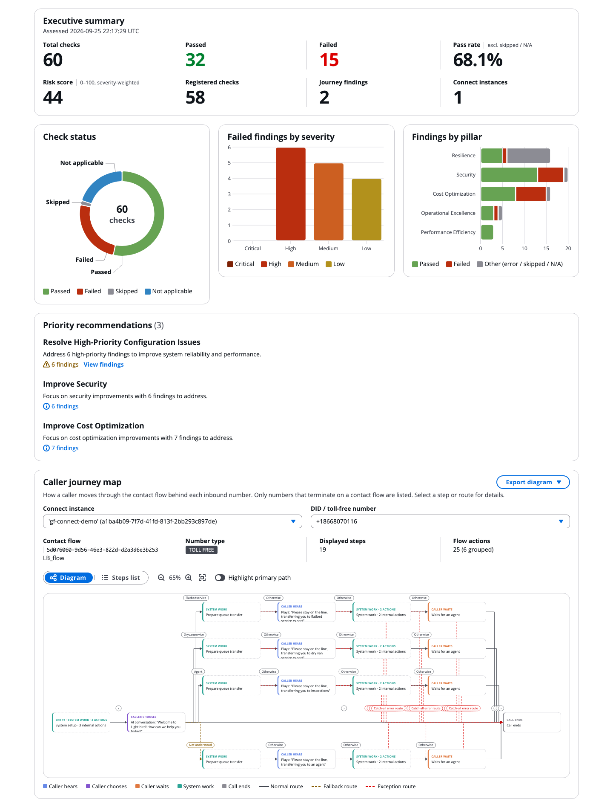
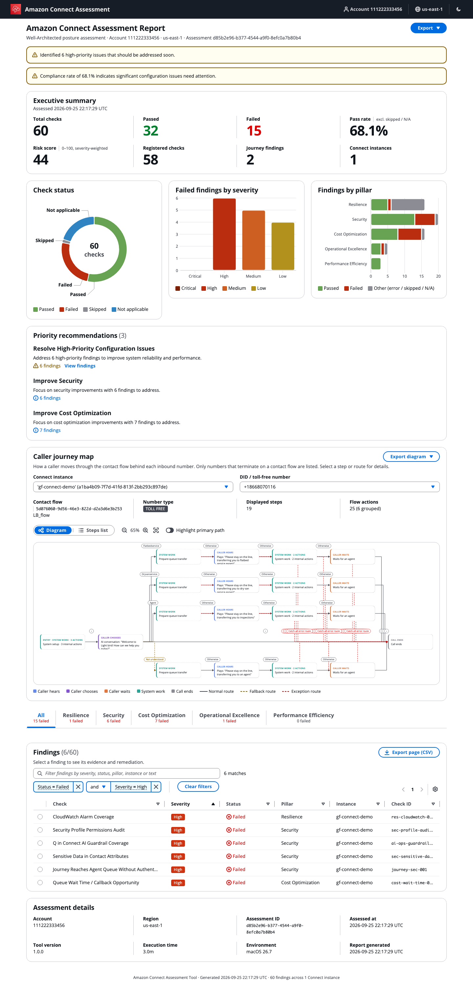

# Amazon Connect Well-Architected Posture Assessment Tool

> Assess Amazon Connect across security, resilience, cost optimization, operational excellence, and performance efficiency using checks informed by AWS Well-Architected best practices.

[](https://www.python.org/downloads/)
[](LICENSE)
[](https://aws.amazon.com/architecture/well-architected/)

A read-only command-line tool that assesses an Amazon Connect Customer
deployment against AWS Well-Architected Framework best practices and produces a
shareable report in minutes. Point it at an AWS account and region, and it
inventories the instance, parses your contact flows, maps what callers actually
experience, and returns prioritized findings with remediation guidance.

No agents, no infrastructure to deploy, and nothing is modified in the account
you assess.

```bash
pipx install git+https://github.com/aws-samples/sample-amazon-connect-posture-assessment
amazon-connect-assessment --region us-east-1 --output-dir ./reports
```

---

## Contents

- [What you get](#what-you-get)
- [Sample report](#sample-report)
- [Quick start](#quick-start)
  - [1. Check prerequisites](#1-check-prerequisites)
  - [2. Install](#2-install)
  - [3. Grant read permissions](#3-grant-read-permissions)
  - [4. Run the assessment](#4-run-the-assessment)
  - [5. Open the report](#5-open-the-report)
- [Common tasks](#common-tasks)
- [What it assesses](#what-it-assesses)
- [Caller Journey Map](#caller-journey-map)
- [Report formats](#report-formats)
- [Architecture](#architecture)
- [Security and privacy](#security-and-privacy)
- [Documentation](#documentation)
- [Contributing and support](#contributing-and-support)
- [License](#license)

---

## What you get

| | |
|---|---|
| **59 assessment checks** | Across all five Well-Architected pillars — Security, Resilience, Cost Optimization, Operational Excellence, and Performance Efficiency. Each finding carries a severity, the evidence behind it, and concrete remediation steps. |
| **Contact flow analysis** | Parses published flow content to find dead-end error paths, unreachable blocks, infinite loops, toll-fraud exposure, prompt-injection risk, and unvalidated Lambda and Lex outputs — issues that are invisible from the console. |
| **Caller Journey Map** | Resolves each inbound phone number to the flow it is actually associated with, enumerates the paths a caller can take, and renders an interactive map you can zoom, inspect, and export. |
| **Generative AI coverage** | Checks Amazon Q in Connect assistants and knowledge bases for guardrails, customer-managed KMS encryption, ingestion health, Bedrock invocation logging, and model cost posture. |
| **Four output formats** | HTML, JSON, CSV, and ASFF for direct ingestion into AWS Security Hub. |
| **Run-over-run comparison** | `--diff` against a previous JSON report shows what was resolved and what is new, so you can track remediation progress. |
| **Safe by default** | Every API call is a read or describe. The single optional write, `--s3-output`, publishes the finished report to its own hardened bucket. |

---

## Sample report

Check out the sample [HTML report](https://aws-samples.github.io/sample-amazon-connect-posture-assessment/examples/sample_assessment_report.html).



<details>
<summary>Show the full report screenshot</summary>



</details>

---

## Quick start

### 1. Check prerequisites

- **Python 3.12 or later** — `python3 --version`
- **AWS credentials** for the account hosting the Amazon Connect Customer instance
- **Network access** to AWS API endpoints

### 2. Install

The recommended install uses [pipx](https://pipx.pypa.io/), which keeps the tool
in its own isolated environment and puts the command on your `PATH`:

```bash
# Install pipx once
brew install pipx                       # macOS
python3 -m pip install --user pipx      # Linux / Windows
python3 -m pipx ensurepath

# Install the assessment tool
pipx install git+https://github.com/aws-samples/sample-amazon-connect-posture-assessment
```

<details>
<summary>Alternative: clone and install from source</summary>

```bash
git clone https://github.com/aws-samples/sample-amazon-connect-posture-assessment
cd sample-amazon-connect-posture-assessment
pipx install .
```

</details>

<details>
<summary>Alternative: AWS CloudShell or a virtual environment</summary>

CloudShell already has credentials and Python available, which makes it the
fastest way to run a one-off assessment. See
[Installation](docs/user-guide.md#installation) in the User Guide for CloudShell
and contributor virtual-environment setup.

</details>

Confirm the install:

```bash
amazon-connect-assessment --version
```

### 3. Grant read permissions

The tool needs read access to Amazon Connect Customer and a handful of
supporting AWS services. Check whether your current identity already has it:

```bash
amazon-connect-assessment --check-permissions --region us-east-1
```

If permissions are missing, deploy the bundled least-privilege policy and attach
it to your IAM user or role:

```bash
aws cloudformation deploy \
  --stack-name amazon-connect-assessment-permissions \
  --template-file cloudformation/AmazonConnectSelfAssessmentPolicy.yaml \
  --parameter-overrides AttachToRoleName=YOUR_ROLE_NAME \
  --capabilities CAPABILITY_NAMED_IAM \
  --region us-east-1
```

Use `AttachToUserName=YOUR_USERNAME` to attach to an IAM user instead, or omit
both parameters to create the policy without attaching it. The exact action list
is published at
[`docs/iam-policy-template.json`](docs/iam-policy-template.json) if you prefer to
fold it into an existing role or permission set.

> **Note:** The CloudFormation template intentionally grants read permissions
> only. It does not include the S3 write permissions required by the optional
> `--s3-output` flag.

### 4. Run the assessment

```bash
amazon-connect-assessment \
  --region us-east-1 \
  --output-dir ./reports
```

The tool discovers every Amazon Connect Customer instance in the region. To
scope the run to one instance, add `--instance-id <instance-id>`.

### 5. Open the report

```bash
open reports/connect_assessment_*.html        # macOS
xdg-open reports/connect_assessment_*.html    # Linux
start reports\connect_assessment_*.html       # Windows
```

The HTML report is a single self-contained file with no external dependencies —
safe to email or attach to a ticket. It is built with the
[Cloudscape Design System](https://cloudscape.design/) (the same components as
the AWS console): a filterable findings table with a details side panel, charts,
light/dark mode, and CSV/JSON export, all working offline.

---

## Common tasks

| Goal | Command |
|---|---|
| Validate access before a long run | `amazon-connect-assessment --check-permissions --region us-east-1` |
| See exactly what would run, without calling AWS | `amazon-connect-assessment --dry-run --region us-east-1` |
| List every check and its severity | `amazon-connect-assessment --list-checks` |
| Assess a single instance | `amazon-connect-assessment --region us-east-1 --instance-id <id>` |
| Focus on one or more pillars | `amazon-connect-assessment --region us-east-1 --pillars security resilience` |
| Report only high-impact findings | `amazon-connect-assessment --region us-east-1 --severity critical high` |
| Run a specific check | `amazon-connect-assessment --region us-east-1 --checks sec-toll-fraud-001` |
| Produce every output format | `amazon-connect-assessment --region us-east-1 --output-format html json csv asff` |
| Compare against a previous run | `amazon-connect-assessment --region us-east-1 --diff ./reports/baseline.json` |
| Publish the report to S3 | `amazon-connect-assessment --region us-east-1 --s3-output` |
| Use a named or SSO profile | `amazon-connect-assessment --profile my-profile --region us-east-1` |
| Speed up a large instance | `amazon-connect-assessment --region us-east-1 --skip-flow-analysis` |
| Troubleshoot with full logging | `amazon-connect-assessment --region us-east-1 -vv --log-file run.log` |

Checks run in parallel by default. Use `--sequential`, `--max-workers`, and
`--batch-size` to tune throughput, and `--resume-assessment` to continue an
interrupted run. See the [User Guide](docs/user-guide.md) and
[Performance Guide](docs/performance-optimization.md) for the full flag
reference, and the [Configuration Guide](docs/configuration.md) to persist your
options in a YAML or JSON config file.

---

## What it assesses

59 checks across the five Well-Architected pillars, plus 4 separately scored
caller journey findings.

| Pillar | Checks | Representative coverage |
|---|---:|---|
| Security | 19 | Storage and KMS encryption, CloudTrail audit coverage, IAM service-role least privilege, security-profile audit, CCP approved origins, toll fraud, prompt injection rated by exploitability, sensitive data in contact attributes, unvalidated Lambda output, Lex conversation-log encryption, Amazon Q guardrail attachment and encryption |
| Resilience | 16 | Amazon Connect Global Resiliency posture (identity type, traffic distribution group status and split, failover testing, phone-number binding), concurrent-call quota headroom and growth projection, configuration-object quota utilization, CloudWatch alarms, flow error handling, loop detection, carrier diversity, per-call-site Lambda dependency risk, Bedrock cross-region inventory |
| Cost Optimization | 15 | Unused claimed numbers, self-service containment, callback opportunities, IVR data continuity into the agent screen pop, DTMF-only self-service tiers, idle configuration, hours-of-operation mismatch, premium-feature enablement, Amazon Q model cost review |
| Operational Excellence | 6 | Contact flow logging, early media, SSML voice fallback, unreachable-block analysis, Amazon Q knowledge-base lifecycle and ingestion health, Bedrock invocation logging |
| Performance Efficiency | 3 | Route-aware Lambda usage, sequential Lambda invocations, descriptive flow-complexity metrics |
| Caller Journey | 4 findings | Phone-number and flow topology scope, caller-path authentication, self-service coverage, dead-end journeys |

Run `amazon-connect-assessment --list-checks` for the live registry, or see the
[Check Catalog](docs/check-catalog.md) for every check ID, its severity, the
permissions it requires, and what it does and does not prove.

Findings are deliberately honest about certainty. Checks that report context
rather than defects — configuration inventory, optional-capability status,
observations that depend on your business requirements — say so in their
description instead of being presented as problems to fix.

---

## Caller Journey Map

Most assessment tooling inspects resources. The Caller Journey Map inspects the
**experience**, starting from the phone number a customer actually dials.

- **Accurate flow resolution.** Each inbound number is matched to its flow using
  `connect:ListFlowAssociations`, rather than assuming
  `ListPhoneNumbersV2.TargetArn` points at a flow.
- **Path enumeration.** Every default, conditional, and error transition is
  walked from each entry point to build the set of paths a caller can take.
- **Scored outcomes.** Paths are scored for authentication, self-service
  coverage, and dead-end outcomes, and surfaced as the four `journey-*` findings.
- **Interactive, offline map.** The CLI computes a deterministic
  caller-focused layout and embeds it in the HTML report. In the browser you can
  switch between phone numbers, zoom and fit without distorting the layout,
  highlight the primary caller path, open any step or route in a details panel
  (routes in and out, underlying contact flow actions, raw Connect outcome
  values), switch to a steps-list view, and export SVG, PNG, or an editable
  draw.io diagram.

No separate web service or launcher is required — it is part of the standard
HTML report.

Phone numbers are masked in report evidence, preserving only the last four
digits.

---

## Report formats

| Format | Flag value | Use it for |
|---|---|---|
| **HTML** | `html` (default) | Review and hand-off. Single self-contained file including the journey map. |
| **JSON** | `json` | Automation, custom dashboards, and as the baseline for `--diff`. |
| **CSV** | `csv` | Spreadsheet triage and remediation tracking. |
| **ASFF** | `asff` | Direct ingestion into AWS Security Hub. |

Combine formats in one run and control naming with `--output-filename`, which
supports the `{timestamp}`, `{account_id}`, and `{region}` placeholders. See
[Report Formats](docs/report-formats.md) for each output contract.

---

## Architecture


The [editable Draw.io source](docs/architecture.drawio) is included.

---

## Security and privacy

- **Read-only against assessed resources.** The tool never mutates the Amazon
  Connect Customer instance, flows, or supporting resources it inspects.
- **Standard credential resolution.** Credentials are resolved through the
  normal boto3 chain and are never written to reports, logs, or checkpoints.
- **Opt-in S3 publishing only.** `--s3-output` is the only write path. If the
  target bucket does not exist, it is created with Block Public Access, SSE-S3
  encryption, and versioning enabled.
- **Reports contain configuration detail.** Findings include flow names, queue
  and routing configuration, and masked phone numbers. Treat generated reports
  as sensitive and store them accordingly.

See the [Threat Model](docs/threat-model.md) for trust boundaries, residual
risks, and hardening recommendations.

---

## Documentation

| Guide | Covers |
|---|---|
| [User Guide](docs/user-guide.md) | Installation paths, AWS access, CLI usage, S3 publishing, run comparison, CI/CD |
| [Configuration](docs/configuration.md) | YAML and JSON settings, precedence, output naming, execution tuning |
| [Check Catalog](docs/check-catalog.md) | Every check and journey finding, required permissions, subset selection |
| [Report Formats](docs/report-formats.md) | HTML, JSON, CSV, and ASFF output contracts |
| [Performance Guide](docs/performance-optimization.md) | Parallel execution, retry tuning, journey-scoring bounds |
| [Troubleshooting](docs/troubleshooting.md) | Installation, credentials, permissions, runtime, and report issues |
| [Threat Model](docs/threat-model.md) | Trust boundaries, attack surfaces, mitigations |
| [Development Guide](docs/development-guide.md) | Architecture, testing, code quality, adding a check |
| [Documentation Index](docs/README.md) | Full documentation map and source-of-truth rules |

---

## Contributing and support

Contributions are welcome. Start with [CONTRIBUTING.md](CONTRIBUTING.md) and the
[Development Guide](docs/development-guide.md) for project setup, test
execution, and the conventions for adding a check.

- **Something not working?** Check [Troubleshooting](docs/troubleshooting.md)
  first, then open a GitHub issue with the output of
  `amazon-connect-assessment --version` and a `-vv` log.
- **Security issue?** Do not open a public issue. Follow the
  [AWS vulnerability reporting process](https://aws.amazon.com/security/vulnerability-reporting/).

This is sample code published for demonstration and evaluation purposes. It is
not an AWS service and is not covered by AWS Support.

---

## License

Licensed under the MIT-0 License. See [LICENSE](LICENSE).