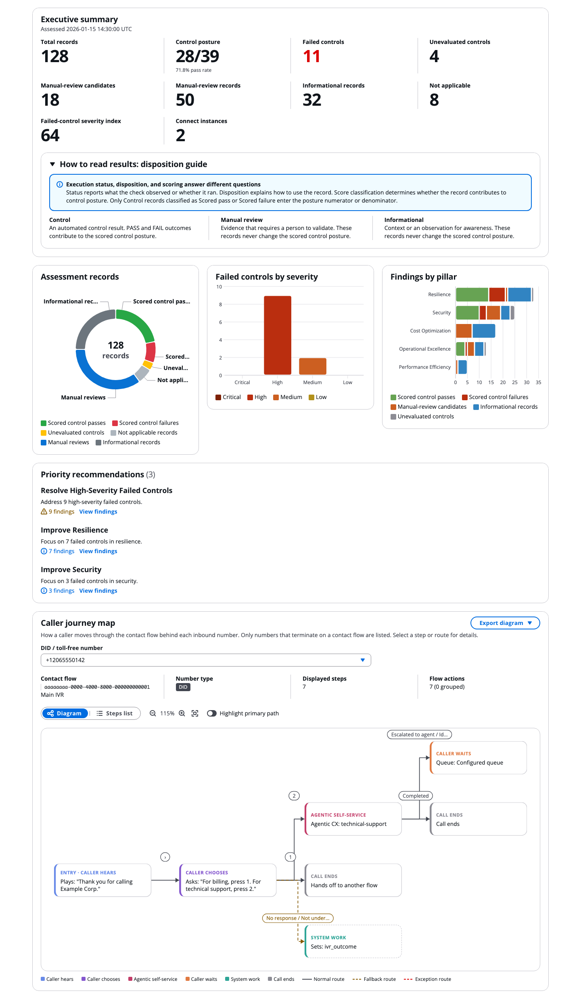
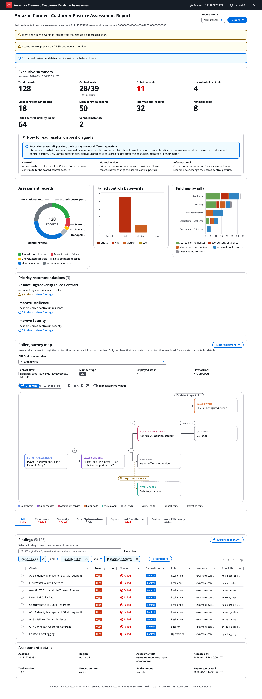
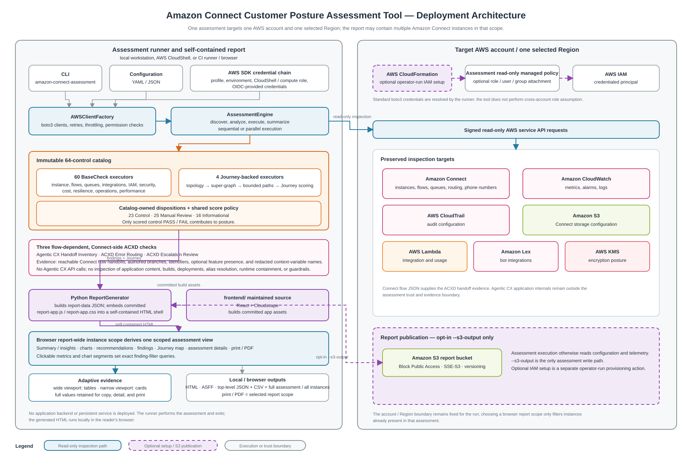

# Amazon Connect Customer Posture Assessment Tool

> Assess Amazon Connect Customer across security, resilience, cost optimization, operational excellence, and performance efficiency using checks informed by AWS Well-Architected best practices.

[](https://www.python.org/downloads/)
[](LICENSE)
[](https://aws.amazon.com/architecture/well-architected/)

A read-oriented-by-default command-line tool that assesses an Amazon Connect Customer
deployment using checks informed by the
[AWS Well-Architected Framework](https://docs.aws.amazon.com/wellarchitected/latest/framework/welcome.html)
and produces a shareable report in minutes. Point it at an AWS account and
region, and it inventories the instance, parses your contact flows, maps what
callers actually experience, and returns prioritized findings with remediation
guidance.

AWS now calls the contact center product
[Amazon Connect Customer](https://docs.aws.amazon.com/connect/latest/adminguide/what-is-amazon-connect.html).
The [AWS CLI](https://docs.aws.amazon.com/cli/latest/reference/connect/index.html)
and [API](https://docs.aws.amazon.com/connect/latest/APIReference/Welcome.html)
service identifier remains `connect`, and this tool's command remains
`amazon-connect-assessment`.

No agents or assessment infrastructure are deployed. Assessed resources are not
modified; only the explicitly enabled `--s3-output` path creates or hardens the
selected report bucket and uploads reports.

```bash
pipx install git+https://github.com/aws-samples/sample-amazon-connect-posture-assessment
amazon-connect-assessment --region us-east-1 --output-dir ./reports
```

---

## Contents

- [What you get](#what-you-get)
- [Sample report](#sample-report)
- [Quick start](#quick-start)
- [Common tasks](#common-tasks)
- [What it assesses](#what-it-assesses)
- [Caller Journey Map](#caller-journey-map)
- [Generative AI coverage](#generative-ai-coverage)
- [Report formats](#report-formats)
- [Architecture](#architecture)
- [Security and privacy](#security-and-privacy)
- [Documentation](#documentation)
- [Contributing and support](#contributing-and-support)
- [License](#license)

---

## What you get

| | |
|---|---|
| **Caller Journey Map** | Starts from the phone number a customer dials, resolves it to the flow it is actually associated with, performs bounded static path enumeration, and renders an interactive map you can zoom, inspect, and export. Enumeration is limited to depth 50, 200 paths per phone number, and 5,000 paths per run. Most tooling audits resources; this audits the experience. |
| **Contact flow analysis** | Parses published flow content to find dead-end error paths, unreachable blocks, infinite loops, toll-fraud exposure, prompt-injection risk, and Lambda branching with no fallback path — issues that are invisible from the console. |
| **64 canonical controls** | One catalog across all five Well-Architected pillars: 60 BaseCheck executors and 4 Journey-backed executors. Every record carries status, disposition, evidence, and methodology so measured controls stay distinct from review candidates and inventory. |
| **Generative AI coverage** | 9 checks spanning Agentic CX Designer, Amazon Q in Connect, and Bedrock. Three Connect-side Agentic CX records inventory the handoff, review escalation intent, and validate error routing without calling Agentic CX APIs or inspecting application internals. See [Generative AI coverage](#generative-ai-coverage). |
| **Quota headroom** | Concurrent-call and configuration-object utilization against your real Service Quotas ceilings, with a 90-day growth trend projecting how long the current rate leaves before you hit one. |
| **Four output formats** | HTML, JSON, CSV, and ASFF for direct ingestion into AWS Security Hub. |
| **Run-over-run comparison** | `--diff` against a previous JSON report shows what was resolved and what is new, so you can track remediation progress. |
| **Safe by default** | Assessment access uses read-oriented `List`, `Get`, `Describe`, and `Head` operations. The consequential opt-in write, `--s3-output`, creates or hardens the selected report bucket and uploads the finished report. |

---

## Sample report

Check out the sample [HTML report](https://aws-samples.github.io/sample-amazon-connect-posture-assessment/examples/sample_assessment_report.html).



<details>
<summary>Show the full report screenshot</summary>



</details>

The HTML report uses the React/Cloudscape frontend maintained in this
repository. The application bundle, fonts, report data, and Journey Map are
embedded into one file so the report remains portable and works offline.
Python computes the accepted Journey Map layout and portable SVG/draw.io
exports; the Cloudscape report renders that same model interactively.

A complete example is checked in at
[`examples/sample_assessment_report.html`](examples/sample_assessment_report.html) —
open it in a browser to see the report before you run anything. It is built from
the unified 64-control catalog by
[`scripts/generate_sample_report.py`](scripts/generate_sample_report.py) against
synthetic instances. It contains one canonical outcome per control and sample
instance, uses fixed timestamps, and contains no customer data.

---

## Quick start

### 1. Check prerequisites

- **Python 3.12 or later** — `python3 --version`
- **AWS credentials** for the account hosting the Amazon Connect Customer instance
- **Network access** to AWS API endpoints

### 2. Install

The recommended install uses [pipx](https://pipx.pypa.io/), which keeps the tool
in its own isolated environment and puts the command on your `PATH`.

First, check whether `pipx` is already installed. Run only the command inside
the code block; do not copy the `bash` label or the triple backticks:

```bash
pipx --version
```

If the command prints a version, skip the installation step. If it reports
`command not found`, install `pipx` for your operating system:

**macOS:**

```bash
brew install pipx
pipx ensurepath
```

**Linux:**

```bash
python3 -m pip install --user pipx
python3 -m pipx ensurepath
```

After installing, open a new terminal and confirm that `pipx` is available:

```bash
pipx --version
```

Then install the assessment tool:

```bash
pipx install git+https://github.com/aws-samples/sample-amazon-connect-posture-assessment
```

If this command succeeds, installation is complete. You do not need to clone
the repository.

#### Verify the installation

Run the version command to confirm that your shell can find the installed CLI
and to display the release that pipx installed:

```bash
amazon-connect-assessment --version
```

If it prints a version, continue to the permissions step. Include this output
when reporting an installation problem. The README intentionally does not name
an expected version, so these instructions remain correct when a new release is
published.

<details>
<summary>Alternative for contributors: clone and install a local checkout</summary>

Use this option only when you want to inspect or modify the source. Skip it if
the primary `pipx install git+...` command succeeded.

```bash
git clone https://github.com/aws-samples/sample-amazon-connect-posture-assessment
cd sample-amazon-connect-posture-assessment
pipx install .
```

</details>

<details>
<summary>Alternative: AWS CloudShell or a virtual environment</summary>

CloudShell already has credentials and Python available, which makes it the
fastest way to run a one-off assessment. See
[Installation](docs/user-guide.md#installation) in the User Guide for CloudShell
and contributor virtual-environment setup.

</details>

### 3. Grant read permissions

The tool needs read access to Amazon Connect Customer and a handful of
supporting AWS services. Check whether your current identity already has it:

```bash
amazon-connect-assessment --check-permissions --region us-east-1
```

If permissions are missing, deploy the bundled least-privilege policy and attach
it to your IAM user or role:

```bash
aws cloudformation deploy \
  --stack-name amazon-connect-assessment-permissions \
  --template-file cloudformation/AmazonConnectSelfAssessmentPolicy.yaml \
  --parameter-overrides AttachToRoleName=YOUR_ROLE_NAME \
  --capabilities CAPABILITY_NAMED_IAM \
  --region us-east-1
```

Use `AttachToUserName=YOUR_USERNAME` to attach to an IAM user instead, or omit
both parameters to create the policy without attaching it. The exact action list
is published at
[`docs/iam-policy-template.json`](docs/iam-policy-template.json) if you prefer to
fold it into an existing role or permission set.

> **Note:** The CloudFormation template intentionally grants read permissions
> only. It does not include the S3 write permissions required by the optional
> `--s3-output` flag.

### 4. Run the assessment

```bash
amazon-connect-assessment \
  --region us-east-1 \
  --output-dir ./reports
```

The tool discovers every Amazon Connect Customer instance in the region. To
scope the run to one instance, add `--instance-id <instance-id>`.

### 5. Open the report

```bash
open reports/connect_assessment_*.html        # macOS
xdg-open reports/connect_assessment_*.html    # Linux
start reports\connect_assessment_*.html       # Windows
```

The HTML report is a single self-contained file that is safe to email or attach
to a ticket. The committed React/Cloudscape bundle, fonts, icons, charts,
report data, findings, and journey diagrams are embedded, so the complete
report remains available offline without a CDN or backend service.

---

## Common tasks

| Goal | Command |
|---|---|
| Validate access before a long run | `amazon-connect-assessment --check-permissions --region us-east-1` |
| See exactly what would run, without calling AWS | `amazon-connect-assessment --dry-run --region us-east-1` |
| List the unified controls, executors, severities, and dispositions | `amazon-connect-assessment --list-checks` |
| Assess a single instance | `amazon-connect-assessment --region us-east-1 --instance-id <id>` |
| Focus on one or more pillars | `amazon-connect-assessment --region us-east-1 --pillars security resilience` |
| Report only high-impact findings | `amazon-connect-assessment --region us-east-1 --severity critical high` |
| Run a specific check | `amazon-connect-assessment --region us-east-1 --checks sec-toll-fraud-001` |
| Produce every output format | `amazon-connect-assessment --region us-east-1 --output-format html json csv asff` |
| Compare against a previous run | `amazon-connect-assessment --region us-east-1 --diff ./reports/baseline.json` |
| Publish the report to S3 | `amazon-connect-assessment --region us-east-1 --s3-output` |
| Use a named or SSO profile | `amazon-connect-assessment --profile my-profile --region us-east-1` |
| Speed up a large instance | `amazon-connect-assessment --region us-east-1 --skip-flow-analysis` |
| Troubleshoot with full logging | `amazon-connect-assessment --region us-east-1 -vv --log-file run.log` |

Checks run in parallel by default. Use `--sequential`, `--max-workers`, and
`--batch-size` to tune throughput, and `--resume-assessment` to continue an
interrupted run. See the [User Guide](docs/user-guide.md) and
[Performance Guide](docs/performance-optimization.md) for the full flag
reference, and the [Configuration Guide](docs/configuration.md) to persist your
options in a YAML or JSON config file.

---

## What it assesses

The unified catalog contains **64 canonical controls**: 60 BaseCheck executors
and 4 Journey-backed executors. The Journey-backed controls are listed with
their owning pillars and appear in `--list-checks`; they are not a separate
findings set.

| Pillar | Canonical controls | Representative coverage |
|---|---:|---|
| Security | 19 | Storage and KMS encryption, CloudTrail coverage, IAM policy inspection, security profiles, approved origins, toll-fraud review, prompt safety, Lex logs, sensitive data, and journey authentication patterns |
| Resilience | 18 | Global Resiliency posture, quota headroom and growth, CloudWatch alarms, Agentic CX error/idle-timeout routing, flow error handling, loop detection, Lambda dependencies, and structural journey dead ends |
| Cost Optimization | 16 | Claimed-number inventory, self-service containment, callback and data-continuity review, idle configuration, operating hours, premium features, model cost, and phone-reachability scope |
| Operational Excellence | 8 | Flow logging, early media, voice fallback, Agentic CX handoff inventory and escalation review, unreachable blocks, Q knowledge-base health, and Bedrock invocation logging |
| Performance Efficiency | 3 | Route-aware Lambda inventory, sequential Lambda review, and flow-structure inventory |

The catalog assigns one of three dispositions to every record: 23 `CONTROL`, 25
`MANUAL_REVIEW`, and 16 `INFORMATIONAL`. Only passed and failed `CONTROL`
records enter the posture score. The scored-control denominator excludes
Skipped, Error, Not Applicable, manual-review, and informational records.

Run `amazon-connect-assessment --list-checks` for the live unified selection, or
see the [Check Catalog](docs/check-catalog.md) for every canonical ID, executor,
disposition, evidence boundary, and verification method. The legacy input IDs
`journey-sec-001` and `journey-cost-001` remain accepted aliases, but reports
and listings emit only `sec-flow-auth-001` and `cost-containment-001`.

A control outcome is measured evidence within its stated limits. A
manual-review outcome identifies a candidate that still needs human validation.
An informational outcome records inventory or planning context. Status tells
you whether execution passed, failed, was skipped, errored, or was not
applicable; it does not change the record's disposition.

---

## Caller Journey Map

Most assessment tooling inspects resources. The Caller Journey Map inspects the
**experience**, starting from the phone number a customer actually dials.

- **Accurate flow resolution.** Each inbound number is matched to its flow using
  `connect:ListFlowAssociations`, rather than assuming
  `ListPhoneNumbersV2.TargetArn` points at a flow.
- **Bounded static path enumeration.** Default, conditional, and error
  transitions are followed from each entry point with limits of depth 50, 200
  paths per phone number, and 5,000 paths per run. Cycle edges are pruned
  without losing structural node reachability. A reached cap, dynamic target,
  or unresolved flow reference marks enumeration incomplete rather than
  claiming exhaustive runtime coverage.
- **Canonical Journey outcomes.** Four catalog controls use the Journey executor:
  `sec-flow-auth-001`, `cost-containment-001`, `journey-res-001`, and
  `journey-scope-001`. Each produces one aggregate outcome per selected
  instance, subject to the same catalog filters as every other control.
- **Interactive, offline map.** The CLI server-renders a deterministic
  caller-focused projection into the HTML report. In the browser you can switch
  between phone numbers, zoom and fit without distorting the layout, open a
  node and connector inspector, and export SVG, PNG, or an editable draw.io
  diagram.

No separate web service or launcher is required — it is part of the standard
HTML report.

Phone numbers are masked in report evidence, preserving only the last four
digits.

---

## Generative AI coverage

Contact centres are where generative AI reached production first, and the
failure modes are new: caller-controlled text reaching a prompt unchanged, a
knowledge base quietly failing to ingest, an unguarded model answering customers
directly, a model invocation with no record of what was said.

Nine checks cover it. Three inspect only the Amazon Connect side of an Agentic
CX Designer handoff; the other six use existing Q in Connect and Bedrock read
APIs. They are deliberately **not** a separate pillar — an unguarded model is a
security finding, a stalled knowledge base is an operational one, and reporting
them anywhere else would hide them from the people who own the fix. This section
is a cross-cutting index into the pillar tables above, not an additional set of
checks: every check below is counted exactly once, in its own pillar.

| Check | Pillar | Severity | What it looks for |
|---|---|---|---|
| `ai-ops-guardrail-001` | Security | High | Amazon Q in Connect assistants serving customers with no AI guardrail attached |
| `ai-ops-encryption-001` | Security | Medium | Q in Connect on AWS-owned keys instead of a customer-managed KMS key |
| `ai-ops-kb-sync-001` | Operational Excellence | Medium | Knowledge-base ingestion health and content lifecycle — a stale base answers confidently and wrongly |
| `ai-ops-bedrock-logging-001` | Operational Excellence | Medium | Bedrock model-invocation logging disabled, leaving no record of what was said |
| `ai-ops-model-cost-001` | Cost Optimization | Low | Prompt model selection against the work each prompt actually does |
| `ai-ops-cross-region-001` | Resilience | Low | Cross-region inference profile availability for the models in use |
| `ops-acxd-handoff-001` | Operational Excellence | Low | Redacted inventory of reachable Connect handoffs, configured workspace/application/alias references, and optional feature presence |
| `ops-acxd-escalation-001` | Operational Excellence | Medium | Manual review of reachable Agentic CX handoffs without an authored condition whose exact token is `Escalation`; this does not prove a successful escalated-to-agent runtime outcome |
| `res-acxd-error-routing-001` | Resilience | High | Reachable Agentic CX handoffs missing idle-timeout or catch-all error routes |

Run only this set:

```bash
amazon-connect-assessment --region us-east-1 --checks \
  ai-ops-guardrail-001 ai-ops-encryption-001 ai-ops-kb-sync-001 \
  ai-ops-bedrock-logging-001 ai-ops-model-cost-001 ai-ops-cross-region-001 \
  ops-acxd-handoff-001 ops-acxd-escalation-001 res-acxd-error-routing-001
```

The six Q in Connect and Bedrock controls report **Not Applicable** when no
relevant integration exists. The three Agentic CX controls report **Not
Applicable** only after complete flow analysis finds no reachable
`ConnectParticipantWithAgenticCX` action. Incomplete clean evidence is Skipped;
a known structural defect still fails. These controls call no Agentic CX APIs
and do not inspect application internals or expose context-variable values.

`sec-prompt-inject-001` is deliberately **not** listed here. It reviews
potentially unsafe dynamic content in SSML and agent-facing prompts. No model is
involved, and a review candidate is not proof of an exploit. It is a Security
finding and appears in that pillar's table.

Amazon Lex guardrail posture is **not** covered. The check that claimed to cover
it could not read a bot's configuration, so it failed every Lex integration it
found regardless of how that bot was actually configured; it was removed rather
than left in the report. See the
[Check Catalog](docs/check-catalog.md#security--19-checks) for what
reimplementing it requires.

What *is* covered for Lex is where a bot's conversations end up:
`sec-lex-convlogs-001` reads each associated bot alias's conversation-log
settings and fails when audio logging writes caller recordings to S3 with no
customer-managed key. It appears under Security rather than here, for the same
reason as `sec-prompt-inject-001` — Lex is intent recognition, not a generative
model, and counting it as AI coverage would overstate what this tool inspects.

---

## Report formats

| Format | Flag value | Use it for |
|---|---|---|
| **HTML** | `html` (default) | Review and hand-off. Single file including the journey map; readable offline. |
| **JSON** | `json` | Automation, custom dashboards, and as the baseline for `--diff`. |
| **CSV** | `csv` | Spreadsheet triage and remediation tracking. |
| **ASFF** | `asff` | Direct ingestion into AWS Security Hub. |

Combine formats in one run and control naming with `--output-filename`, which
supports the `{timestamp}`, `{account_id}`, and `{region}` placeholders. HTML,
JSON, and CSV preserve canonical IDs, disposition, methodology, and the
scored-control numerator/denominator. ASFF exports failed `CONTROL` records
only. See [Report Formats](docs/report-formats.md) for each output contract.

---

## Architecture



The [editable Draw.io source](docs/architecture.drawio) is included.

---

## Security and privacy

- **Read-only against assessed resources.** The tool never mutates the Amazon
  Connect Customer instance, flows, or supporting resources it inspects.
- **Standard credential resolution.** Credentials are resolved through the
  normal boto3 chain and are never written to reports, logs, or checkpoints.
- **Consequential opt-in S3 publishing.** `--s3-output` is the only write path.
  It creates a missing selected bucket or hardens an existing selected bucket
  by applying Block Public Access and versioning and ensuring default
  encryption, then uploads the report. Review the target and permissions before
  enabling it.
- **Reports contain configuration detail.** Findings include flow names, queue
  and routing configuration, and masked phone numbers. Treat generated reports
  as sensitive and store them accordingly.

See the [Threat Model](docs/threat-model.md) for trust boundaries, residual
risks, and hardening recommendations.

---

## Documentation

| Guide | Covers |
|---|---|
| [User Guide](docs/user-guide.md) | Installation paths, AWS access, CLI usage, S3 publishing, run comparison, CI/CD |
| [Configuration](docs/configuration.md) | YAML and JSON settings, precedence, output naming, execution tuning |
| [Check Catalog](docs/check-catalog.md) | All 64 canonical controls, dispositions, methodology, executor ownership, aliases, and filter behavior |
| [Report Formats](docs/report-formats.md) | HTML, JSON, CSV, and ASFF output contracts |
| [Performance Guide](docs/performance-optimization.md) | Parallel execution, retry tuning, journey-scoring bounds |
| [Troubleshooting](docs/troubleshooting.md) | Installation, credentials, permissions, runtime, and report issues |
| [Threat Model](docs/threat-model.md) | Trust boundaries, attack surfaces, mitigations |
| [Development Guide](docs/development-guide.md) | Architecture, testing, code quality, adding a check |
| [Documentation Index](docs/README.md) | Full documentation map and source-of-truth rules |

---

## Contributing and support

Contributions are welcome. Start with [CONTRIBUTING.md](CONTRIBUTING.md) and the
[Development Guide](docs/development-guide.md) for project setup, test
execution, and the conventions for adding a check.

- **Something not working?** Check [Troubleshooting](docs/troubleshooting.md)
  first, then open a GitHub issue with the output of
  `amazon-connect-assessment --version` and a `-vv` log.
- **Security issue?** Do not open a public issue. Follow the
  [AWS vulnerability reporting process](https://aws.amazon.com/security/vulnerability-reporting/).

This is sample code published for demonstration and evaluation purposes. It is
not an AWS service and is not covered by AWS Support.

---

## License

Licensed under the MIT-0 License. See [LICENSE](LICENSE).
